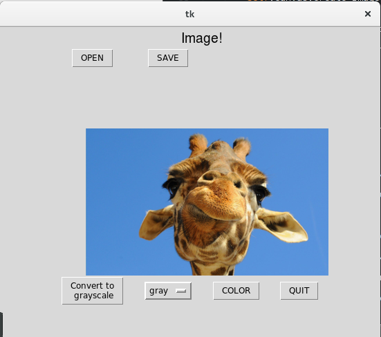
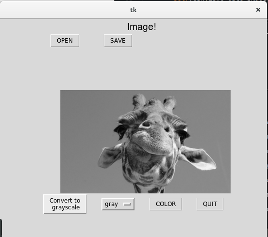
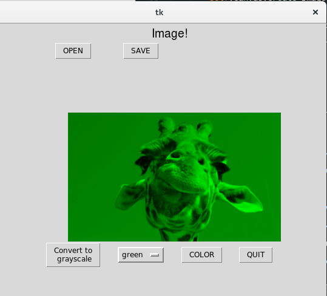

###Laboratory Assignment#1 for Multimedia Systems

The task for this assignment is to develop a desktop application that loads one or more images from a file and displays them in a window. The action chosen is to convert the image to grayscale; colorize the image (apply a colour to the grayscale image); save resulting image. 
The action can also be performed on the image, by using UI controls.

For image manipulation it was used PIL (Python Image Library), for desktop presentation and widgets it was used tkinter.

The results for this assignment are presented in the following pictures:

* Button open is pressed and user chooses the image to be loaded in the application. Then the image is loaded.
    
* Button Convert to Grayscale is pressed and the image is converted into Grayscale.
    
* User chooses a color from Option Menu widget and presses the button color and the image is colorized with the color selected.
    

####Conclusion:
This lab assignment helped me to familiarize better with image manipulation and what techniques are used for that.