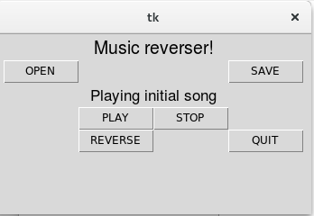
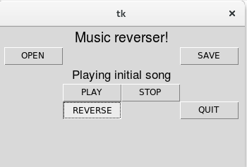
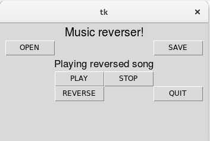

###Laboratory Assignment#2 Multimedia Systems

The task for this assignment is to develop desktop application that loads a sound from a file and is capable of playing it, with a
modification as well as without it. The modification is reversing the song.

For playing the song it was used subprocess module that deals with starting a process of ffplay. For manipulating the sound it was used pydub library. 

The result of this piece of code is the following:

* 
* 
* 