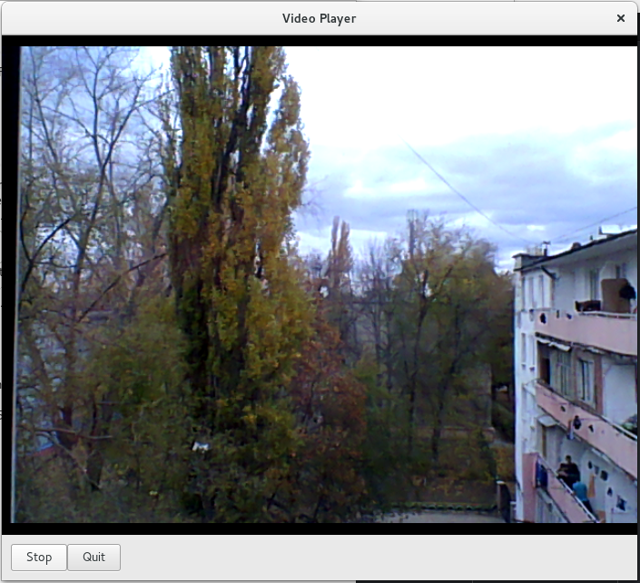

###Laboratory Assignment#3 Multimedia Systems

The task for this assignment is to Develop a desktop application that does show in real time the input from the webcam. 

The library used it Gstreamer that is used for constructing graphs of media-handling components. 
For UI it was used GTK. 

GStreamer can be used straight forward from command line and do the basic functionality real time display form a webcam input. The linux command is the following:
```v4l2src ! autovideosink```

* ```v4l2src``` - Reads frames from a Video4linux2 device that in this case is the web camera.
* ```autovideosink``` - Wrapper video sink for automatically detected video sink

The result of this script is shown in the following picture:


####Conclusion

During the accomplishement of this assignment, I got to know another library of multimedia systems and manipulation that I might use in the future. Also, I got more familiar with how to develop an UI for Linux. 


####Bibliography

* [Gstreamer Official Website](http://gstreamer.freedesktop.org/)
* [Blog post: Using GStreamer Python](http://www.jonobacon.org/2006/08/28/getting-started-with-gstreamer-with-python/)
* [Python GStreamer Tutorial by Jens Persson, Ruben Gonzalez and Brett Viren](http://brettviren.github.io/pygst-tutorial-org/pygst-tutorial.pdf)